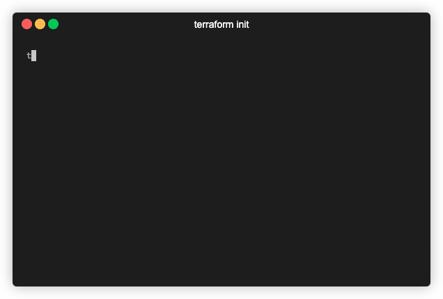
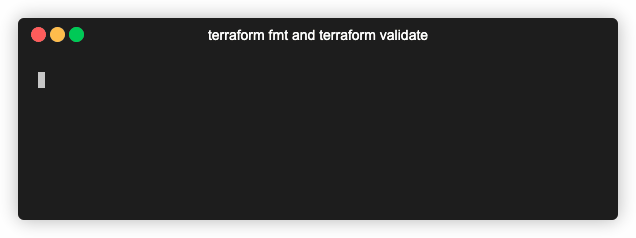
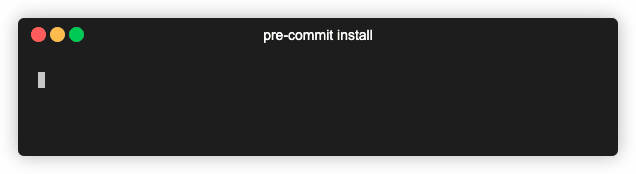
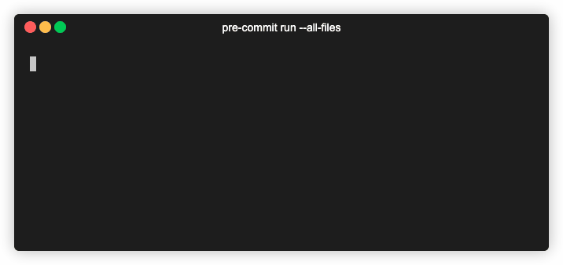
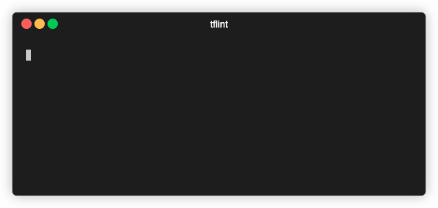

# Code Quality for Terraform

> This repository contains low-quality Terraform code that uses the [Google Provider](https://www.terraform.io/docs/providers/google/index.html) to showcase a handful of ways of improving code hygiene and quality.

## Table of Contents

- [Code Quality for Terraform](#code-quality-for-terraform)
  - [Table of Contents](#table-of-contents)
  - [Important Links](#important-links)
  - [Tools](#tools)
  - [Usage](#usage)
  - [Code Quality](#code-quality)
    - [Using built-in tooling](#using-built-in-tooling)
    - [Using pre-commit locally](#using-pre-commit-locally)
    - [Using pre-commit via GitHub Actions](#using-pre-commit-via-github-actions)
    - [Using TFLint](#using-tflint)
    - [Using GitHub Actions](#using-github-actions)
  - [Notes](#notes)
  - [Author Information](#author-information)
  - [License](#license)

## Important Links

- Slides: [speakerdeck.com/ksatirli/code-quality-for-terraform](https://speakerdeck.com/ksatirli/code-quality-for-terraform)
- Code: [github.com/ksatirli/code-quality-for-terraform](https://github.com/ksatirli/code-quality-for-terraform)

### Tools

- Local options:
  - [terraform fmt](https://www.terraform.io/docs/commands/fmt.html)
  - [terraform validate](https://www.terraform.io/docs/commands/validate.html)
  - [TFLint](https://github.com/terraform-linters/tflint)
  - [pre-commit](https://pre-commit.com)
- Remote options:
  - [GitHub Actions](https://github.com/features/actions)
  - [GitHub Super-Linter](https://www.terraform.io/docs/github-actions/index.html)
  - [Terraform GitHub Actions](https://www.terraform.io/docs/github-actions/index.html)

## Usage

Start by copying [terraform.tfvars.sample](https://github.com/ksatirli/code-quality-for-terraform/blob/main/terraform.tfvars.sample) to `terraform.tfvars` and fill in your GCP-specific information:

```hcl
project_id     = "my-project-identifier" # replace with your GCP Project Identifier
project_domain = "my-domain.com"         # replace with your GCP Project Domain
```

Then, initialize the Terraform directory (`.terraform/`) by running `terraform init`:



This downloads the Google Provider for Terraform (as specified in [terraform.tf](https://github.com/ksatirli/code-quality-for-terraform/blob/main/terraform.tf)) and ensures you are running the correct Terraform version.

## Code Quality

Terraform projects rarely exist in isolation. A repository containing Terraform files (`.tf`) will often contain related files in one or more of the following formats:

- HCL (`.hcl`)
- JSON (`.json`)
- Markdown (`.md` and `.mdx`)
- Shell scripts (`.sh` and `.bash`)
- YAML (`.yaml` and `.yml`)

Ensuring proper code quality for _all_ files is important, as an uncaught error in one type of file may result in a Terraform Resources not being created, correctly.

While it is outside the scope of this repository to advise you on linting rules for all the above files, you are encouraged to check out [@operatehappy/dotfiles-org](https://github.com/operatehappy/dotfiles-org) for a collection of code quality configurations that work _well_ with Terraform-adjacent code.

### Using built-in tooling

Terraform includes two very useful utilities to improve the quality of your code, without the need for external applications.

To format your code, using the canonical rules, use `terraform fmt`. Then, validate your code using `terraform validate`:



### Using `pre-commit` locally

To use `pre-commit` locally, follow the installation instructions on [pre-commit.com](https://pre-commit.com/#install) and then initialize your repository:



This will configure `.git/hooks/pre-commit` to reflect your local `pre-commit` installation.

On every commit, `git` (including GUI clients) will now run all checks listed in [.pre-commit-config.yaml](https://github.com/ksatirli/code-quality-for-terraform/blob/main/.pre-commit-config.yaml).

Next to automated runs, it is possible to invoke these checks manually. For this, you can use `pre-commit run --all-files`:



### Using `pre-commit` via GitHub Actions

It is _possible_ to run `pre-commit` as part of [GitHub Actions](https://github.com/features/actions). This process is involved and requires the following:

- access to `pre-commit` inside of GitHub Actions
- a check-out of the code you want to run `pre-commit` against

Depending on the `pre-commit` handlers you want to run, you will need to install various applications that are then used as part of `pre-commit`.

A sample implementation of this process, including checking out an organization-wide `pre-commit` configuration can be found in [@operatehappy/terraform-aws-route53-workmail-records](https://github.com/operatehappy/terraform-aws-route53-workmail-records/blob/master/.github/workflows/code-quality.yml).

A simpler (but just as powerful) approach to running a large amount of linters remotely is to use [GitHub Super-Linter](https://github.com/github/super-linter).

### Using TFLint

To use TFLint, follow the [installation instructions](https://github.com/terraform-linters/tflint#installation). Once installed, you can run `tflint`:



This repository includes a sample [.tflint.hcl](https://github.com/ksatirli/code-quality-for-terraform/blob/main/.tflint.hcl) configuration that may serve as a starting point for your own ruleset.

### Using GitHub Actions

GitHub Actions are enabled by default on any GitHub Repository.

This repository includes two workflow definition files in [.github/workflows/](https://github.com/ksatirli/code-quality-for-terraform/tree/expands-readme/.github/workflows) that may serve as a starting point for your own workflows.

## Notes

- The `main` branch includes a working example of code quality tools and some GCP-specific Terraform resources. This branch is best used to understand how things work together
- The `unlinted` branch includes a handful of misconfigurations (in the `.tf` files) to test the various code quality tools.
- The `tools-only` branch includes _just_ the configuration of `pre-commit`, `tflint` and GitHub Actions for Terraform as well as GitHub Super-Linter. This branch is best used as a starting point: just add your own `.tf` files and go!

## Author Information

This repository is maintained by [Kerim Satirli](https://github.com/ksatirli).

## License

Licensed under the Apache License, Version 2.0 (the "License").

You may obtain a copy of the License at [apache.org/licenses/LICENSE-2.0](http://www.apache.org/licenses/LICENSE-2.0).

Unless required by applicable law or agreed to in writing, software distributed under the License is distributed on an _"AS IS"_ basis, without WARRANTIES or conditions of any kind, either express or implied.

See the License for the specific language governing permissions and limitations under the License.
